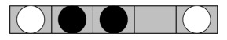

# Trabalho Prático (DCC014) - Régua-Puzzle

## Integrantes

- Matheus Rubio
- Giovane Nilmer

## Divisão de Tarefas

- **Matheus Rubio**

   - Implementação da estrutura inicial do projeto;
   - Implementação do algoritmo de backtracking;
   - Implementação do algoritmo de busca em largura;
   - Implementação do algoritmo de busca em profundidade;
   - Implementação do algoritmo de busca ordenada;

- **Giovane Nilmer**

   - Implementação do algoritmo de busca gulosa;
   - Implementação do algoritmo de busca A*;
   - Implementação do algoritmo de busca IDA*;

## Problemática

O jogo das fichas(régua-puzzle) consiste em um jogo de tabuleiro com uma única linha, um espaço vazio e um número igual de fichas pretas e brancas.

O jogo a princípio não possui um objetivo definido, depende de um contexto específico para que seja definido tal objetivo, dessa forma, existem várias possibilidades de objetivos para o jogo.

<p align="center">
   
<p>

### Exemplo de objetivo
   - Colocar as peças pretas entre as peças brancas.

### Operações Permitidas
   - Deslizar uma ficha para um espaço vazio.
   - Saltar uma ficha sobre outra em direção ao espaço vazio.

## Implementação

O projeto foi desenvolvido utilizando a linguagem de programação Typescript, com o auxilio do runtime Node.js.

### Principais Classes

- **Logger.ts**: Classe responsável por exibir mensagens de erro, avisos, sucesso e informações no console.

- **Tree.ts**: Classe responsável por representar a árvore gerada em cada um dos algoritmos de busca.

- **Node.ts**: Classe responsável por representar um nó da árvore gerada em cada um dos algoritmos de busca.

- **Edge.ts**: Classe responsável por representar uma aresta da árvore gerada em cada um dos algoritmos de busca.

- **PriorityQueue.ts**: Classe responsável por representar as filas de prioridade utilizadas nos algoritmos de Busca Gulosa e A*.

### Formato de Entrada

Para poder executar qualquer um dos algoritmos, somente 4 parâmetros são necessários:

- **Tamanho da régua**: Número de fichas no tabuleiro.
   - Deve ser sempre um número ímpar e maior que 3, que é o mínimo possível.
- **Estado inicial do jogo**: Estado inicial da régua.
   - String separada por vírgula onde cada caractere entre as vírgulas só poderá ser ‘P’(Preto), ‘B’(Branco) e ‘-’(Vazio) EX: ```P,P,P,-,B,B,B```
   - Os números de peças pretas e brancas devem ser iguais.
   - Somente poderá haver um único espaço vazio.
- **Estado final desejado**: Estado final da régua.
   - As mesmas regras do estado inicial, mas deve ser diferente do estado inicial.
- **Altura máxima da árvore de solução**: Número inteiro que representa a altura máxima da árvore de solução.
   - Precisa ser um número maior que 0.

### Menu

Ao serem informadas as informações de entrada, o usuário terá a opção de escolher qual algoritmo deseja utilizar para resolver o problema através do menu abaixo:

```
   | Tamanho da régua: 7
   | Estado inicial do jogo: P,P,P,-,B,B,B
   | Estado final desejado: B,B,B,-,P,P,P
   | ↓ Selecione uma opção ↓ |
   | 1 - Backtracking
   | 2 - Busca em Largura
   | 3 - Busca em Profundidade
   | 4 - Busca Ordenada
   | 5 - Busca Gulosa
   | 6 - Busca A*
   | 7 - Busca IDA*
   | -1 - Sair
   | Opção: _
```
Para todos os algoritmos no menu disponíveis para execução, mais um parâmetro é solicitado ao usuário que é o tamanho máximo da árvore de solução, a presença desse parâmetro é necessária principalmente para evitar estouros de memórias em alguns casos.

```
| Digite a profundidade dá árvore desejada: _
```

### Resultado da Execução

Ao final da execução de qualquer um dos algoritmos, o usuário terá como retorno o caminho, a quantidade de nós expandidos, a quantidade de nós visitados, o custo, o fator de ramificação médio e o tempo de execução.

```
----------------------------------------
| Nós visitados: 12
| Nós expandidos: 11
| Custo da solução: 12
| Caminho: P,P,P,-,B,B,B -> P,P,-,P,B,B,B -> P,-,P,P,B,B,B -> -,P,P,P,B,B,B -> B,P,P,P,-,B,B -> B,P,P,-,P,B,B -> B,P,-,P,P,B,B -> B,-,P,P,P,B,B -> B,P,P,P,P,-,B -> B,P,P,P,-,P,B -> B,P,P,-,P,P,B -> B,P,-,P,P,P,B -> B,-,P,P,P,P,B -> B,P,P,P,P,P,-
| Fator de ramificação médio: 1.0909090909090908
| Tempo de execução: 0.002s
----------------------------------------
```

### Principais Funções

- **main**: Função principal do projeto, responsável por apresentar o menu ao usuário, solicitar as informações de entrada e chamar a função que executa o algoritmo escolhido.

- **getAllPossibilitiesFromNode**: Função responsável por gerar todos os possíveis estados a partir de um nó.
   - A partir da posição do espaço vazio no tabuleiro, a função gera todos os possíveis estados que podem ser alcançados a partir do estado atual.
   - **EX1**: [P,-,P,B,B]  →  [P,P,-,B,B]
   - **EX2**: [P,-,P,B,B]  →  [P,B,P,-,B]

- **getSelectedMaxDepth**: Função responsável por permitir ao usuário informar um número inteiro positivo para definir a profundidade máxima que a árvore poderá atingir em sua execução.

### Principais dificuldades encontradas

- **Definição da heurística**:

   Para tornar eficientes os algoritmos Guloso, A* e IDA*, foi pensada uma heurística que pudesse representar bem a "distância" entre o estado atual e o estado objetivo, dessa forma, pela representação ser feita numa cadeia de caracteres, optou-se por medir o número de posições nas quais - tanto para o estado atual como o objetivo - tem-se caracteres diferentes (entre "P", "B" ou "-"). Ex.: tendo respectivamente **[P,P,-,B,B]** e **[B,B,-,P,P]** como os estados atual e objetivo, a heurística para essa jogada seria de 4.

- **Estouro de memória**
   
   Devido a quantidade de estados possíveis que podem ser gerados a partir de um nó, a árvore de solução pode crescer de forma exponencial, dessa forma, foi necessário a definição de um limite para a altura da árvore de solução.
- **Backtracking sem estados repetidos**

   Não conseguimos implementar o backtracking sem estados repetidos. 

### Estatísticas de Execução


# Execução do projeto

Para que seja possível executar o projeto, será necessário cumprir alguns pré-requisitos.

## Pré-requisitos

Possuir o Node.js instalado em sua máquina, no link abaixo ensina como instalar em ambientes linux e windows.
- [Tutorial de instalação Node.JS](https://www.alura.com.br/artigos/como-instalar-node-js-windows-linux-macos?utm_term&utm_campaign=%5BSearch%5D+%5BPerformance%5D+-+Dynamic+Search+Ads+-+Artigos+e+Conte%C3%BAdos&utm_source=adwords&utm_medium=ppc&gad_source=1)

## Instalação das dependências

Após a instalação do Node.js, você terá disponível para utilização o NPM (Node Package Manager) que é o gerenciador de dependências nativo do node.

Para instalar as dependências do projeto, será necessário a utilização do comando

```bash
   npm install
```

Com as dependências instaladas, basta iniciar a execução do projeto com o comando

```bash
   npm run dev
```
